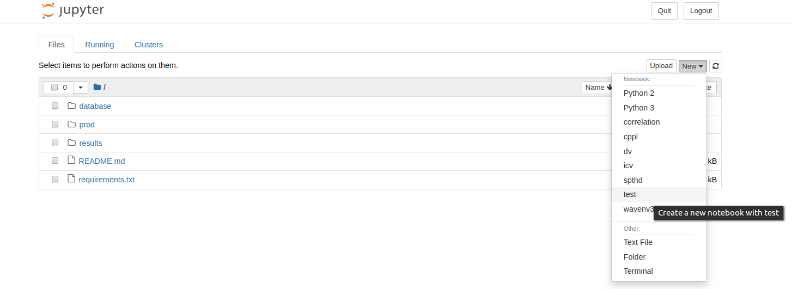
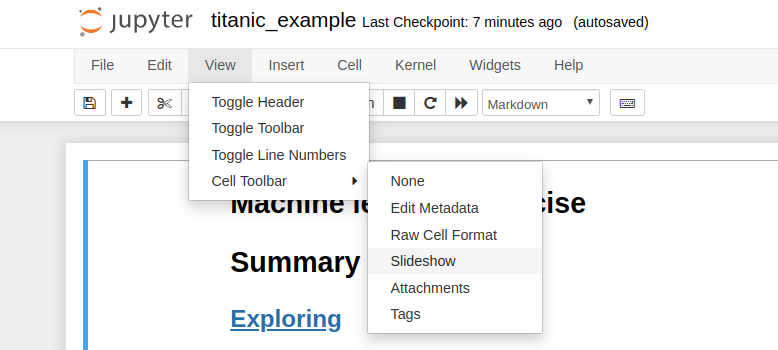
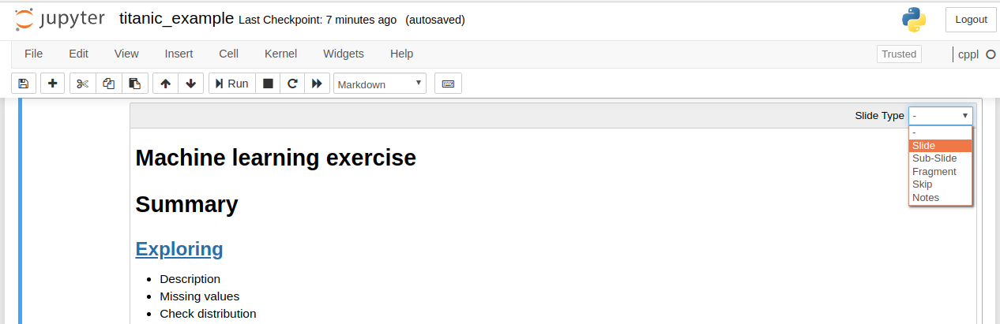

I found myself quite often going back to the instructions to do some tasks when using virtualenvs and jupyter notebooks, so instead of learning them by memory I decided to make my own notes to come here every time I need to and find everything in one place.

## Summary

### <a href="#venv">VirtualEnv</a>
Notes about installing, setting, selecting python version and activating virtualenvs.
### <a href="#notebook">Jupyter notebook</a>
Notes related to the notebooks, installing, and setting up a kernel with a virtualenv.
### <a href="#scroll">Scroll to in jupyter notebooks</a>
How to add Index or summaries like this one in a notebook or a markdown file.
### <a href="#nbtohtml">Jupyter notebook to HTML</a>
Steps to convert a jupyter notebook into an HTML file.
### <a href="#nbtoslide">Jupyter notebook to Slideshow</a>
Steps to make a notebook work as a slideshow.
### <a href="#mdtohtml">Extra: Markdown file to HTML</a>
Convert a markdown file like this one into an HTML file you can publish.

UPDATE: Jupyter notebooks can be downloaded from the begining as HTML, Slides, Markdown, etc. The option is in the `File>>Download as` section.

<a id='venv'></a>
## VirtualEnv
To know more check: [https://docs.python-guide.org/dev/virtualenvs/](https://docs.python-guide.org/dev/virtualenvs/)

Type the next commands on your terminal.

* Install virtualenv:
`pip install virtualenv`

* Create a folder for your environments:
`mkdir ~/Envs`

* Go to folder:
`cd ~/Envs`

* Create virtualenv:
`virtualenv test`

* Create virtualenv for specific python version:
`virtualenv -p /usr/bin/python3.6 test`

* Activate environment:
`source ~/Envs/test/bin/activate`

* Install dependencies!

* Send dependencies to a txt file:
`pip3 freeze >> requirements.txt`

* To deactivate:
`deactivate`


<a id='notebook'></a>
## Jupyter notebook

Check the documentation: [https://jupyter.org/](https://jupyter.org/)

* Install:
`pip3 install jupyter`

* Install kernel with virtualenv  in jupyter:
`ipython kernel install --user --name=test`

* start notebook:
`jupyter notebook`

* Select a new kernel with your environment



* Enjoy!


<a id='scroll'></a>
## Add Index with ‘scroll to’ functionality to jupyter notebooks

Let’s say you have at the beginning of your notebook the Index or the summary of your content.

```
# Summary
## Exploring
* Description
* Missing values
* Check distribution
```

What we do is add this a tag with a reference to a tag with an id named exploration:

```
<a href="#exploration"></a>
```

In the following way:

```
# Summary
## <a href="#exploration">Exploring</a>
* Description
* Missing values
* Check distribution
```

Then, in the respective section of your notebook (In the exploration section), we add a text cell with a tag using an id named "exploration":

```
<a id='exploration'></a>
## Explore data
```

And that’s it! Now it’s really easy to walk through large notebooks and go exactly to the section of interest.

You can check the "Summary" section in the beginning of this post as an example of this.


<a id='nbtohtml'></a>
## Convert Jupyter Notebooks into HTML

I found this one recently and I just use it every time now.

Library: [https://nbconvert.readthedocs.io/en/latest/](https://nbconvert.readthedocs.io/en/latest/)

First we need to install nbconvert library and one dependency:

`pip3 install nbconvert`

`sudo apt-get install pandoc`

Then, convert!

Default way:

`jupyter nbconvert notebook.ipynb`

If you want to add another format (is supports pdf, markdown, latex, etc):

`jupyter nbconvert --to FORMAT notebook.ipynb`

If you want to convert full html (`--template full`) or an embedding to add to your blog (`--template basic`):

`jupyter nbconvert --to html --template basic notebook.ipynb`

And done, add this to your github repo and it will look awesome, including the javascript form your plots. tables, etc.


<a id='nbtoslide'></a>
## Convert Jupyter Notebooks into Slides
In fact the same tool from above can transofrm a notebook into a nice slide-show.

First run the notebook:
`jupyter notebook`

Then, go to the menu bar and click on `view--> Cell Toolbar--> Slideshow`



After that check the top right side of your cells and select `slide`.



Finally run on the terminal:
`jupyter nbconvert --to slides notebook.ipynb --post serve`

The notebook will be converted to a slide and run automatically in your browser.

To stop it just hit `ctrl+C` on the terminal.

It can also be ran as:
`jupyter nbconvert --to slides notebook.ipynb`

Just to convert it and look at it later as a normal HTML file.


<a id='mdtohtml'></a>
## Extra: Markdown to html
I used this to create blog posts by writing a markdown file and transform them into html.

Then I discovered jekyll, but I'll add this part just in case I need it in the future.

Libraries:

[https://github.com/Python-Markdown/markdown](https://github.com/Python-Markdown/markdown)

[https://pygments.org/](https://pygments.org/)

Install libraries:

`pip3 install markdown`

`pip3 install Pygments`

The first one is to convert markdown files and the second to create a CSS in case we need it.

Convert:

```bash
python -m markdown notes.md > notes.html
```

Convert with CSS:
```bash
python -m markdown -x codehilite notes.md > notes.html
```

```bash
pygmentize -S default -f html > codehilite.css
```

Add html with CSS and other useful links:

```html
<!DOCTYPE html>
<html lang="en">

<head>
<meta charset="utf-8">
<link rel="stylesheet" type="text/css" href="./codehilite.css">
</head>

<body>

    Markdown transformed content

</body>
</html>
```

That is it!
