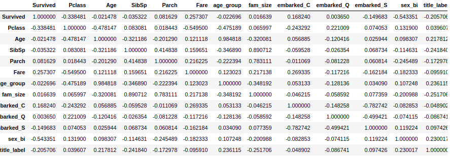
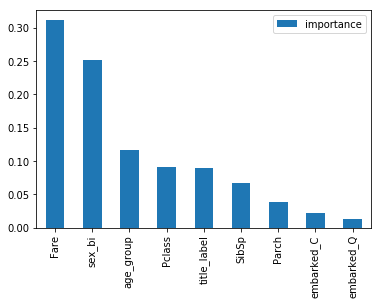

This notebook is part of a data science pipeline exercise, the full project can be found [here](https://jfreek.github.io/ml_pipeline/).

We'll go through each step to solve one of the classic Kaggle data science challenges.
The dataset can be found [here](https://www.kaggle.com/c/titanic/data).

# Summary

## <a href="#exploration">Exploring</a>
* Data description
* Check distribution
* Missing values

## <a href="#cleansingandfeatureeng">Cleansing and Feature Engineering</a>
* Filling missing values.
* New features.

## <a href="#encoding">Encoding</a>
* Encoding: Labels, binary, one-hot.

## <a href="#featuresel">Feature Selection</a>
* Check correlations
* Dropping features

## <a href="#models">Baseline Modeling</a>
* Random forest
* Logistic regression
* Naive bayes
* SVM
* Compare models

## <a href="#balance">Bias-Variance Balance</a>
* Train vs test errors
* confusion matrix: from 2 best models

## <a href="#attack">Attacking identified variance problem:</a>
* Dropping features
* Check feature importance
* Drop more features
* Hyperparameter tuning: with random search
    - Adding more samples
    - Regulirize model: Set number of leafs and max depth
* Re-train with best estimator and best features.
* Fit our estimator

## <a href="#end">Save model and Next steps</a>

# Let's begin

<a id='exploration'></a>
## Explore data

```python
import numpy as np 
import pandas as pd 
import seaborn as sns
%matplotlib inline
from matplotlib import pyplot as plt

data = pd.read_csv('titanic_dataset.csv')
```

### Data description

`PassengerId` Unique ID of the passenger

`Survived` Survived (1) or died (0)

`Pclass` Passenger's class (1st, 2nd, or 3rd)

`Name`Passenger's name

`Sex` Passenger's sex

`Age` Passenger's age

`SibSp` Number of siblings/spouses aboard the Titanic

`Parch` Number of parents/children aboard the Titanic

`Ticket` Ticket number

`Fare` Fare paid for ticket

`Cabin` Cabin number

`Embarked` Where the passenger got on the ship (C - Cherbourg, S - Southampton, Q = Queenstown)


### Checking missing values and DF info in general


```python
data.info()
```

    <class 'pandas.core.frame.DataFrame'>
    RangeIndex: 891 entries, 0 to 890
    Data columns (total 12 columns):
    PassengerId    891 non-null int64
    Survived       891 non-null int64
    Pclass         891 non-null int64
    Name           891 non-null object
    Sex            891 non-null object
    Age            714 non-null float64
    SibSp          891 non-null int64
    Parch          891 non-null int64
    Ticket         891 non-null object
    Fare           891 non-null float64
    Cabin          204 non-null object
    Embarked       889 non-null object
    dtypes: float64(2), int64(5), object(5)
    memory usage: 83.6+ KB


We have some missing values on `Age`, `Cabin` and `Embarked`

### Checking data distribution


```python
data.describe()
```


<div>
<style scoped>
    .dataframe tbody tr th:only-of-type {
        vertical-align: middle;
    }

    .dataframe tbody tr th {
        vertical-align: top;
    }

    .dataframe thead th {
        text-align: right;
    }
</style>
<table border="1" class="dataframe">
  <thead>
    <tr style="text-align: right;">
      <th></th>
      <th>PassengerId</th>
      <th>Survived</th>
      <th>Pclass</th>
      <th>Age</th>
      <th>SibSp</th>
      <th>Parch</th>
      <th>Fare</th>
    </tr>
  </thead>
  <tbody>
    <tr>
      <th>count</th>
      <td>891.000000</td>
      <td>891.000000</td>
      <td>891.000000</td>
      <td>714.000000</td>
      <td>891.000000</td>
      <td>891.000000</td>
      <td>891.000000</td>
    </tr>
    <tr>
      <th>mean</th>
      <td>446.000000</td>
      <td>0.383838</td>
      <td>2.308642</td>
      <td>29.699118</td>
      <td>0.523008</td>
      <td>0.381594</td>
      <td>32.204208</td>
    </tr>
    <tr>
      <th>std</th>
      <td>257.353842</td>
      <td>0.486592</td>
      <td>0.836071</td>
      <td>14.526497</td>
      <td>1.102743</td>
      <td>0.806057</td>
      <td>49.693429</td>
    </tr>
    <tr>
      <th>min</th>
      <td>1.000000</td>
      <td>0.000000</td>
      <td>1.000000</td>
      <td>0.420000</td>
      <td>0.000000</td>
      <td>0.000000</td>
      <td>0.000000</td>
    </tr>
    <tr>
      <th>25%</th>
      <td>223.500000</td>
      <td>0.000000</td>
      <td>2.000000</td>
      <td>20.125000</td>
      <td>0.000000</td>
      <td>0.000000</td>
      <td>7.910400</td>
    </tr>
    <tr>
      <th>50%</th>
      <td>446.000000</td>
      <td>0.000000</td>
      <td>3.000000</td>
      <td>28.000000</td>
      <td>0.000000</td>
      <td>0.000000</td>
      <td>14.454200</td>
    </tr>
    <tr>
      <th>75%</th>
      <td>668.500000</td>
      <td>1.000000</td>
      <td>3.000000</td>
      <td>38.000000</td>
      <td>1.000000</td>
      <td>0.000000</td>
      <td>31.000000</td>
    </tr>
    <tr>
      <th>max</th>
      <td>891.000000</td>
      <td>1.000000</td>
      <td>3.000000</td>
      <td>80.000000</td>
      <td>8.000000</td>
      <td>6.000000</td>
      <td>512.329200</td>
    </tr>
  </tbody>
</table>
</div>


We can see 38% of people survived. Also, is interesting to see the max and min of certain features like Age and Fare.

I don't see any weird values or outliers that don't make sense or would affect the analysis.

...Just checking


```python
data['Survived'].unique()
```


    array([0, 1])


<a id='cleansingandfeatureeng'></a>
## Cleansing and Feature Engineering

The first thing to know is that we have (obviously) a classification problem.
The steps I think we need to take are the following:

* We need to deal with missing values from `Age`, `Cabin` and `Embarked`
* It seems to be a good idea to create a new feature combining `SibSp` and `Parch`: `fam_size`.
* Also, from `Name` we can extract a new feature: `Title`. Which would give us some information about the person.
* We also need to represent our features as numbers somehow, in particular `Title`, `Embarked`, `Cabin` and `Sex`.
    - `Embarked` does not seem to have any levels so one-hot encoding might work
    - `Sex` can be binary
    - `Cabin` might be tricky
    - `Title` can be a label encoding since it seems there are levels

### Missing values


```python
total = data.isnull().sum().sort_values(ascending=False)

percent = total/len(data)*100

missing_data = pd.concat([total, percent], axis=1, keys=['Total', '%'])
missing_data.head(5)
```


<div>
<style scoped>
    .dataframe tbody tr th:only-of-type {
        vertical-align: middle;
    }

    .dataframe tbody tr th {
        vertical-align: top;
    }

    .dataframe thead th {
        text-align: right;
    }
</style>
<table border="1" class="dataframe">
  <thead>
    <tr style="text-align: right;">
      <th></th>
      <th>Total</th>
      <th>%</th>
    </tr>
  </thead>
  <tbody>
    <tr>
      <th>Cabin</th>
      <td>687</td>
      <td>77.104377</td>
    </tr>
    <tr>
      <th>Age</th>
      <td>177</td>
      <td>19.865320</td>
    </tr>
    <tr>
      <th>Embarked</th>
      <td>2</td>
      <td>0.224467</td>
    </tr>
    <tr>
      <th>Fare</th>
      <td>0</td>
      <td>0.000000</td>
    </tr>
    <tr>
      <th>Ticket</th>
      <td>0</td>
      <td>0.000000</td>
    </tr>
  </tbody>
</table>
</div>


`Cabin` has 77% of missing values, I think it makes sense to get rid of it.

`Embarked` is a categorical feature and has 2 missing values so I think it makes sense to fill it with the mode

**Check description**
```python
data['Embarked'].describe()
```


    count     889
    unique      3
    top         S
    freq      644
    Name: Embarked, dtype: object


**Unique values**

```python
data['Embarked'].unique()
```


    array(['S', 'C', 'Q', nan], dtype=object)


**The mode**
```python
data['Embarked'].mode().iloc[0]
```


    'S'


**Filling missing values with the mode**

```python
data['Embarked'] = data['Embarked'].fillna(data['Embarked'].mode().iloc[0])
data['Embarked'].unique()
```


    array(['S', 'C', 'Q'], dtype=object)

**Now with Age**

`Age` seems like a good feature for predicting survival, so I think we can do the following...

It is a good idea to check if it make sense to bucket the values.

Then, if it does, we can see the relationship between `Age` and the features `SibSp`, `Parch`and `Fare`.

Afterwards, for each missing value we check the `SibSp`, `Parch` and `Fare` values and by the similarity between its values and each bucket values we assign a bucket and then a median age of that bucket.

I chose `SibSp`, `Parch` and `Fare` because they seem to be more related to `Age`... but let's check that.


```python
data.corr(method='pearson')['Age']
```


    PassengerId    0.036847
    Survived      -0.077221
    Pclass        -0.369226
    Age            1.000000
    SibSp         -0.308247
    Parch         -0.189119
    Fare           0.096067
    Name: Age, dtype: float64


So it seems `SibSp`, `Parch` and `Pclass` are the most correlated (negatively).

**Bucketing**


```python
''' 
Buckets:
    0: 0-11, 1:12-17, 2:18-24, 3:25-34, 4:35-44, 5:45-54, 6:55-64, 7:65-80, 8:NaN
'''
bins = (12,18,25,35,45,55,65,80)
categories = np.digitize(data['Age'], bins)
data['age_group'] = categories
```

**Looking correlations to find 'similarities' between groups and other fields**
```python
data.corr(method='pearson')['age_group']
```


    PassengerId    0.000795
    Survived      -0.115885
    Pclass        -0.048274
    Age            0.979672
    SibSp         -0.132612
    Parch         -0.218272
    Fare          -0.028155
    age_group      1.000000
    Name: age_group, dtype: float64


**Creating vectors per age group**
```python
''' 
The results should be a dict with bins as keys and 3 value vectors as values.
e.g.:
    {
    1:[2.5,4.3,1],
    2:[3.2, 2.1,2],
    .
    . etc..
    }
'''
desc = {}
for group in [0,1,2,3,4,5,6,7]:
    desc[group] = []
    desc[group].append(round(data[data['age_group']==group]['SibSp'].mean(),2))
    desc[group].append(round(data[data['age_group']==group]['Parch'].mean(), 2))
    desc[group].append(round(data[data['age_group']==group]['Pclass'].mean(), 2))
    desc[group] = np.array(desc[group])
desc
```


    {0: array([1.88, 1.43, 2.63]),
     1: array([0.82, 0.49, 2.51]),
     2: array([0.33, 0.29, 2.46]),
     3: array([0.33, 0.19, 2.35]),
     4: array([0.37, 0.56, 2.  ]),
     5: array([0.41, 0.32, 1.67]),
     6: array([0.16, 0.32, 1.45]),
     7: array([0.1, 0.2, 1.8])}


**Checking euclidean distance between vectors**
```python
from scipy.spatial import distance

'''
e.g.

arr = np.array([0,0,3])
s = distance_category(desc, arr)
res = 2
'''

def distance_category(desc, arr1):
    scores = {}
    for group in [0,1,2,3,4,5,6,7]:
        scores[distance.euclidean(desc[group], arr1)] = group
    return scores[min(scores.keys())]
```


```python
data['isnull'] = data['Age'].isnull()
data['age_group'] = data.apply(lambda x: 
                               distance_category(desc, np.array([x['SibSp'], x['Parch'], x['Pclass']])) 
                               if x['isnull'] else x['age_group'], axis=1)
```

**Estimating age by group similarity**

Using the mean age per group.

```python
age_estim = {}
for group in [0,1,2,3,4,5,6,7]:
    age_estim[group] = int(data[data['age_group']==group]['Age'].mean())
age_estim        
```


    {0: 4, 1: 15, 2: 21, 3: 29, 4: 38, 5: 48, 6: 59, 7: 68}


```python
data['Age'] = data.apply(lambda x: age_estim[x['age_group']] if x['isnull'] else x['Age'], axis=1)

data = data.drop('isnull', axis=1)
```


Awesome, now we don't have any missing values and we have a new feature `age_group`

### Family size

I decided Family size might be a good indicator so we'll add it just by adding Siblings-Spouse plus Parents-Children


```python
data['fam_size'] = data.apply(lambda x: x['SibSp']+x['Parch'], axis=1)
```

### Title Extraction


```python
import re

# Some titles I watched on a quick search
title_list=['Mrs', 'Mr', 'Master', 'Miss', 'Major',
            'Dr', 'Ms', 'Capt','Don', 'other']
patterns = {
    re.compile(r'Mrs', re.IGNORECASE): 'Mrs',
    re.compile(r'Mr', re.IGNORECASE): 'Mr',
    re.compile(r'Master', re.IGNORECASE): 'Master',
    re.compile(r'Miss', re.IGNORECASE): 'Miss',
    re.compile(r'Major', re.IGNORECASE): 'Major',
    re.compile(r'Dr', re.IGNORECASE): 'Dr',
    re.compile(r'Ms', re.IGNORECASE): 'Ms',
    re.compile(r'Capt', re.IGNORECASE): 'Capt',
    re.compile(r'Don', re.IGNORECASE): 'Don',
}

def find_title(name):
    title = 'Other'
    for patt, val in patterns.items():
        if re.search(patt, name):
            title = val
    return title
```


```python
data['title'] = data['Name'].map(lambda x: find_title(x))
```


<a id="encoding"></a>
## Encoding

We have to transform discrete columns: `Title`, `Embarked`, `Cabin` and `Sex` into numbers.
I think it would be a good idea to do the following:
 
 * `Embarked`: One-hot encoding, 3 categories
 
 * `Sex`: Binary, 2 categories
 
 * `Cabin`: droped
 
 * `Title`: can be a label encoding (are there levels?)
 
 
 We can try this approach and see how it goes.
 
 Other options might be: 
 
 * `Sex`: One-hot encoding, 2 categories
 
 * `Title`: One-hot encoding
 

### Embarked Encoding


```python
data = pd.concat([data, pd.get_dummies(data['Embarked'],prefix='embarked')],axis=1)
data = data.drop('Embarked', axis=1)
```

### Sex Encoding


```python
data['sex_bi'] = data['Sex'].map(lambda x: 1 if x=='male' else 0)
data = data.drop('Sex', axis=1)
```

### Title encoding


```python
from sklearn import preprocessing

label_encoder = preprocessing.LabelEncoder()
data['title_label'] = label_encoder.fit_transform(data['title'])

data.groupby('title')['title_label'].unique()
```


    title
    Capt      [0]
    Don       [1]
    Dr        [2]
    Major     [3]
    Master    [4]
    Miss      [5]
    Mr        [6]
    Ms        [7]
    Other     [8]
    Name: title_label, dtype: object


```python
# drop original title
data = data.drop('title', axis=1)
```

<a id="featuresel"></a>
## Feature Selection

I'll start by selecting empirically
* Some features I really don't see how they would help like `Cabin`, `PassengerId`, `Name` and `Ticket`

### Dropping some features


```python
data = data.drop(['Cabin', 'Name', 'Ticket', 'PassengerId'], axis=1)
```


### Correlations


```python
data.corr()
```




We have some obvious strong correlations between `SibSp`, `Parch` and `fam_size`, since we created that feature with them.

Also, between `Age` and `age_group`.

It's interesting to see that the only not obviuos strong correlation between the labels are between `embarked_S` and `embarked_C`.


The strongest correlation between the target and the features is with `sex_bi`, then `Pclass`.

<a id="models"></a>
# Baseline models

I think we can try and build some models using these features and check the results


```python
from sklearn.ensemble import RandomForestClassifier
from sklearn.linear_model import LogisticRegression
from sklearn.naive_bayes import GaussianNB
from sklearn.svm import SVC

from sklearn.model_selection import cross_val_score, cross_validate
from sklearn.metrics import roc_auc_score
```

I'll use **K-fold cross validation** to make our results more robust and take advantage of the STD, which we can use it as a "range of confidence" for the performance of the model.

The only reason I use it is because we have a relatively small dataset and we can afford to do it in a short period of time, otherwise I would probably use regular cross validation.

Also, I am using a recall scoring, because the dataset is imbalanced (about 40/60), so accuracy is not very useful.

**Recall = TP/(TP+FN)**, which tells us the % of correctly classified positive values.

Another option could be Precision or F1-score (precision and recall combined). But we care more about the percentage of positives correctly classified.

The important point here is to avoid being affected by the imbalanced problem.


```python
X_train = data.drop("Survived", axis=1)
Y_train = data["Survived"]

results = {'model':[], 'recall':[]}
```

### Random forest


```python
rf = RandomForestClassifier(n_estimators=100, bootstrap = True, n_jobs=-1)
scores = cross_val_score(rf, X_train, Y_train, cv=10, scoring='recall')

results['model'].append('randomforest')
results['recall'].append(scores.mean())

print("Scores:", scores)
print("Mean:", scores.mean())
print("Standard Deviation:", scores.std())
```

    Scores: [0.74285714 0.68571429 0.58823529 0.88235294 0.85294118 0.73529412
     0.70588235 0.58823529 0.82352941 0.82352941]
    Mean: 0.7428571428571429
    Standard Deviation: 0.09853886285323533


### Logistic Regression


```python
logreg = LogisticRegression(solver='liblinear')
scores = cross_val_score(logreg, X_train, Y_train, cv=10, scoring = "recall")

results['model'].append('logitregression')
results['recall'].append(scores.mean())

print("Scores:", scores)
print("Mean:", scores.mean())
print("Standard Deviation:", scores.std())
```

    Scores: [0.65714286 0.71428571 0.58823529 0.82352941 0.76470588 0.64705882
     0.61764706 0.64705882 0.70588235 0.67647059]
    Mean: 0.6842016806722689
    Standard Deviation: 0.06667716415716068


### Naive Bayes


```python
gaussian = GaussianNB()

scores = cross_val_score(gaussian, X_train, Y_train, cv=10, scoring = "recall")

results['model'].append('naivebayes')
results['recall'].append(scores.mean())


print("Scores:", scores)
print("Mean:", scores.mean())
print("Standard Deviation:", scores.std())
```

    Scores: [0.68571429 0.74285714 0.67647059 0.82352941 0.79411765 0.73529412
     0.73529412 0.73529412 0.67647059 0.79411765]
    Mean: 0.7399159663865547
    Standard Deviation: 0.04891629769816727


### SVM


```python
svm = SVC(kernel='rbf', gamma='auto')

scores = cross_val_score(svm, X_train, Y_train, cv=10, scoring = "recall")

results['model'].append('svm')
results['recall'].append(scores.mean())

print("Scores:", scores)
print("Mean:", scores.mean())
print("Standard Deviation:", scores.std())
```

    Scores: [0.6        0.6        0.5        0.61764706 0.61764706 0.52941176
     0.70588235 0.64705882 0.64705882 0.67647059]
    Mean: 0.6141176470588235
    Standard Deviation: 0.05924554499771376

### Comparing models

```python
res = pd.DataFrame(results)
res = res.sort_values(by='recall', ascending=False)
res
```


<div>
<style scoped>
    .dataframe tbody tr th:only-of-type {
        vertical-align: middle;
    }

    .dataframe tbody tr th {
        vertical-align: top;
    }

    .dataframe thead th {
        text-align: right;
    }
</style>
<table border="1" class="dataframe">
  <thead>
    <tr style="text-align: right;">
      <th></th>
      <th>model</th>
      <th>recall</th>
    </tr>
  </thead>
  <tbody>
    <tr>
      <th>0</th>
      <td>randomforest</td>
      <td>0.742857</td>
    </tr>
    <tr>
      <th>2</th>
      <td>naivebayes</td>
      <td>0.739916</td>
    </tr>
    <tr>
      <th>1</th>
      <td>logitregression</td>
      <td>0.684202</td>
    </tr>
    <tr>
      <th>3</th>
      <td>svm</td>
      <td>0.614118</td>
    </tr>
  </tbody>
</table>
</div>


<a id="balance"></a>
# Bias-Variance Balance

Now I want to know where I am in the bias-variance balance, even though we have good models if we want to improve accuracy we need to know first where we are so we know where we are going (how to improve).

For classification we can use a confusion matrix. I'll do it for the first 2 best models


```python
from sklearn.metrics import confusion_matrix
from sklearn.model_selection import train_test_split
```

### Random forest

**train vs test Error**


```python
rf = RandomForestClassifier(n_estimators=100, bootstrap = True)
scores = cross_validate(rf, X_train, Y_train, cv=10, scoring='recall', return_train_score=True)

print("Train score:", scores['train_score'].mean())
print("Test score:", scores['test_score'].mean())
```

    Train score: 0.9730329117136935
    Test score: 0.728235294117647


**Confusion matrix**


```python
X = data.drop("Survived", axis=1)
Y = data["Survived"]

train, test, target_train, target_test = train_test_split(X, Y, test_size=0.2, shuffle=True ,random_state=6)
```


```python
rf = RandomForestClassifier(n_estimators=100, bootstrap = True)
y_pred = rf.fit(train, target_train).predict(test)
```


```python
arr = confusion_matrix(target_test, y_pred)
df = pd.DataFrame(arr, index = ['true_0', 'true_1'],
                  columns = ['pred_0', 'pred_1'])
df
```


<div>
<style scoped>
    .dataframe tbody tr th:only-of-type {
        vertical-align: middle;
    }

    .dataframe tbody tr th {
        vertical-align: top;
    }

    .dataframe thead th {
        text-align: right;
    }
</style>
<table border="1" class="dataframe">
  <thead>
    <tr style="text-align: right;">
      <th></th>
      <th>pred_0</th>
      <th>pred_1</th>
    </tr>
  </thead>
  <tbody>
    <tr>
      <th>true_0</th>
      <td>99</td>
      <td>14</td>
    </tr>
    <tr>
      <th>true_1</th>
      <td>17</td>
      <td>49</td>
    </tr>
  </tbody>
</table>
</div>


**Based on Train/Test Error**

For RF we can see we have some **overfitting**, that means we might have a variance problem.

To diminish the error we could regularized our model or select fewer features and see what happens.

* For the first one we could try searching for best hyperparameters (regulirizers).
* For the second we could find the best features and train with them.
* Another option could be to increase the numbers of trees used (n_estimators>100).

We can start by dropping `Age` and `fam_size`, since are the ones with the least correlation with the target.

### Naive Bayes

**test vs train Error**


```python
gaussian = GaussianNB()
scores = cross_validate(gaussian, X_train, Y_train, cv=10, scoring=['recall', 'accuracy'], return_train_score=True)

print("Train acc:", scores['train_accuracy'].mean())
print("Test acc:", scores['test_accuracy'].mean())

print("Train recall:", scores['train_recall'].mean())
print("Test recall:", scores['test_recall'].mean())
```

    Train acc: 0.7866315140797283
    Test acc: 0.784652706843718
    Train recall: 0.738785481619358
    Test recall: 0.7399159663865547


**confusion matrix**


```python
y_pred = gaussian.fit(train, target_train).predict(test)
```


```python
arr = confusion_matrix(target_test, y_pred)
df = pd.DataFrame(arr, index = ['true_0', 'true_1'],
                  columns = ['pred_0', 'pred_1'])
df
```


<div>
<style scoped>
    .dataframe tbody tr th:only-of-type {
        vertical-align: middle;
    }

    .dataframe tbody tr th {
        vertical-align: top;
    }

    .dataframe thead th {
        text-align: right;
    }
</style>
<table border="1" class="dataframe">
  <thead>
    <tr style="text-align: right;">
      <th></th>
      <th>pred_0</th>
      <th>pred_1</th>
    </tr>
  </thead>
  <tbody>
    <tr>
      <th>true_0</th>
      <td>97</td>
      <td>16</td>
    </tr>
    <tr>
      <th>true_1</th>
      <td>16</td>
      <td>50</td>
    </tr>
  </tbody>
</table>
</div>


**Based on Train/Test Error**

On the case of Naive Bayes since the error difference between the scores is not much we can say we don't have a lot of variance, it seems to be more of a **bias** problem or some **noise**.

This indicates that we may need to work more on our features to make them more significant or add new ones.

<a id="attack"></a>
## Attacking the problem

### Dropping obvious features for RF

I will try to improve the Random Forest model since I think the steps are more straight forward and for tor this exercise purposes.

But it seems like NB is less affected by imbalance... and kind of makes sense to take into account the "real" prior probability of survival.


```python
drop1 = data.drop(['Age', 'fam_size'], axis=1)
```


```python
X_train = drop1.drop("Survived", axis=1)
Y_train = drop1["Survived"]
```


```python
rf = RandomForestClassifier(n_estimators=100, bootstrap = True)
scores = cross_validate(rf, X_train, Y_train, cv=10, scoring='recall', return_train_score=True)

print("Train score:", scores['train_score'].mean())
print("Test score:", scores['test_score'].mean())
```

    Train score: 0.9230043572063117
    Test score: 0.7105882352941176


```python
drop2 = drop1.drop(['embarked_S'], axis=1)
```


```python
X_train = drop2.drop("Survived", axis=1)
Y_train = drop2["Survived"]
```

I will also increase the # of samples for this one


```python
rf = RandomForestClassifier(n_estimators=1000, bootstrap = True)
scores = cross_validate(rf, X_train, Y_train, cv=10, scoring='recall', return_train_score=True)

print("Train score:", scores['train_score'].mean())
print("Test score:", scores['test_score'].mean())
```

    Train score: 0.9217014256102203
    Test score: 0.728235294117647


I did closed the gap a little, but the difference is not much

### Random forest for feature importance


```python
import matplotlib.pyplot as plt

rf.fit(X_train, Y_train)

feat_imp = pd.DataFrame(rf.feature_importances_,
                                   index = X_train.columns,
                                    columns=['importance']).sort_values('importance', ascending=False)

feat_imp.plot.bar(y='importance')
```





### Dropping least important features


```python
drop3 = drop2.drop(['embarked_C', 'embarked_Q'], axis=1)
```


```python
X_train = drop3.drop("Survived", axis=1)
Y_train = drop3["Survived"]
```


```python
rf = RandomForestClassifier(n_estimators=1000, bootstrap = True)
scores = cross_validate(rf, X_train, Y_train, cv=10, scoring='recall', return_train_score=True)

print("Train score:", scores['train_score'].mean())
print("Test score:", scores['test_score'].mean())
```

    Train score: 0.9187761749651001
    Test score: 0.7252941176470588


### Hyperparameters tunning


```python
from sklearn.model_selection import RandomizedSearchCV

# Hyperparameter grid
param_grid = {
    'n_estimators': np.linspace(50, 1000).astype(int),
    'max_depth': [None] + list(np.linspace(3, 20, 100).astype(int)),
    'max_features': ['log2', 'sqrt', None] + list(np.arange(0.5, 1, 0.1)),
    'max_leaf_nodes': [None] + list(np.linspace(2, 10, 50, 500).astype(int)),
    'min_samples_split': [2, 5, 10, 30],
    'criterion': ["gini", "entropy"],
    'bootstrap': [True],
    'oob_score':[True],
}

# Estimator for use in random search
estimator = RandomForestClassifier(n_jobs = -1, random_state = 42)

# Create the random search model
rs = RandomizedSearchCV(estimator, param_grid, n_jobs = -1, scoring='recall', return_train_score=True,
                       cv =10, n_iter=10, verbose = 1, random_state=78)

# Fit 
rs.fit(X_train, Y_train)
```

```python
rs.best_estimator_
```


    RandomForestClassifier(bootstrap=True, class_weight=None, criterion='gini',
                           max_depth=8, max_features=None, max_leaf_nodes=7,
                           min_impurity_decrease=0.0, min_impurity_split=None,
                           min_samples_leaf=1, min_samples_split=5,
                           min_weight_fraction_leaf=0.0, n_estimators=903,
                           n_jobs=-1, oob_score=True, random_state=42, verbose=0,
                           warm_start=False)


### Validation


```python
rf = rs.best_estimator_

scores = cross_validate(rf, X_train, Y_train, cv=10, scoring=['recall', 'accuracy'], 
                        return_train_score=True, return_estimator=True)

print("Train acc:", scores['train_accuracy'].mean())
print("Test acc:", scores['test_accuracy'].mean())

print("Train recall:", scores['train_recall'].mean())
print("Test recall:", scores['test_recall'].mean())
```

    Train acc: 0.8337693015809753
    Test acc: 0.8238415049370106
    Train recall: 0.7342410846482508
    Test recall: 0.7191596638655462


We managed to close the gap, the results are not that different from the naive bayes model though. 

But let's move on.

### Look for best estimator and save model

Our final RF model has a recall socre of 88%, not bad at all.


```python
from sklearn.externals import joblib

max_score = scores['test_recall'].max()
e = np.where(scores['test_recall']==max_score)[0][0]

print("estimator with best recall score: ", e, 
     " Score: ", max_score)

model = scores['estimator'][e]

# save the model to disk
filename = 'rf1.sav'
joblib.dump(model, filename)
```

    estimator with best recall score:  3  Score:  0.8823529411764706


<a id="end"></a>
## NEXT STEPS

I have reduced the varience significantly but it seems we still have some overfitting and we could also benefit if we increase our model performance in general.

* Deal with imbalanced data: I would suggest re-sampling the data with a synthetic method (SMOTE). (For RF model)
* Try with Naive bayes model, improve performance.
* Improve features: by using other encoding or some clever engineering.
    - Combine features in a meaningful way (or randomly).
    - Carefully choose encoding method
